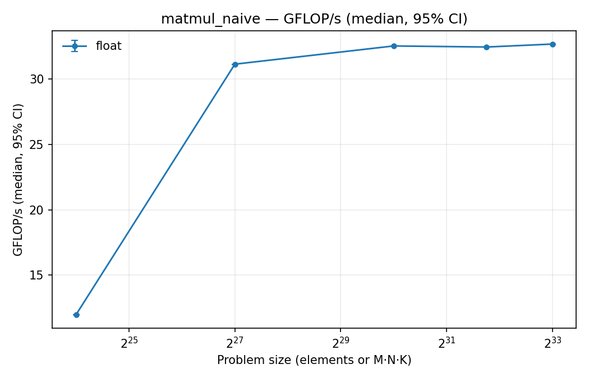
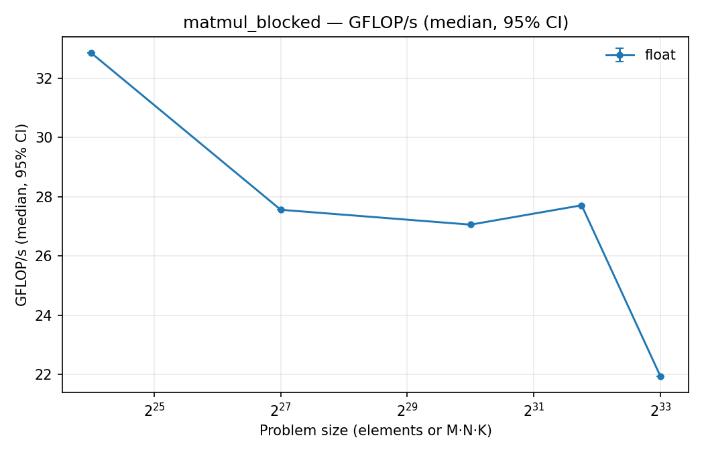
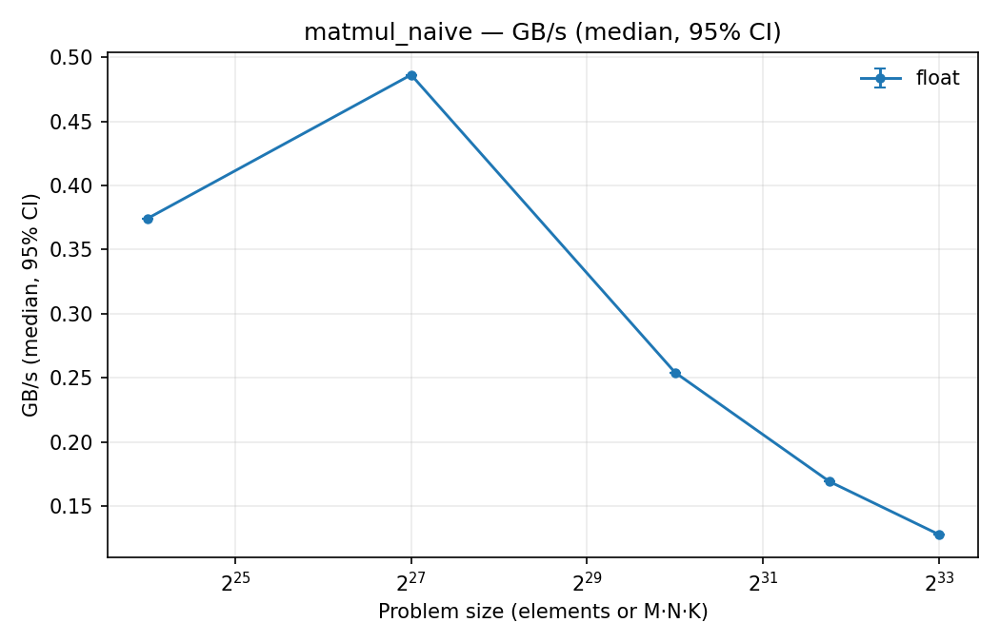
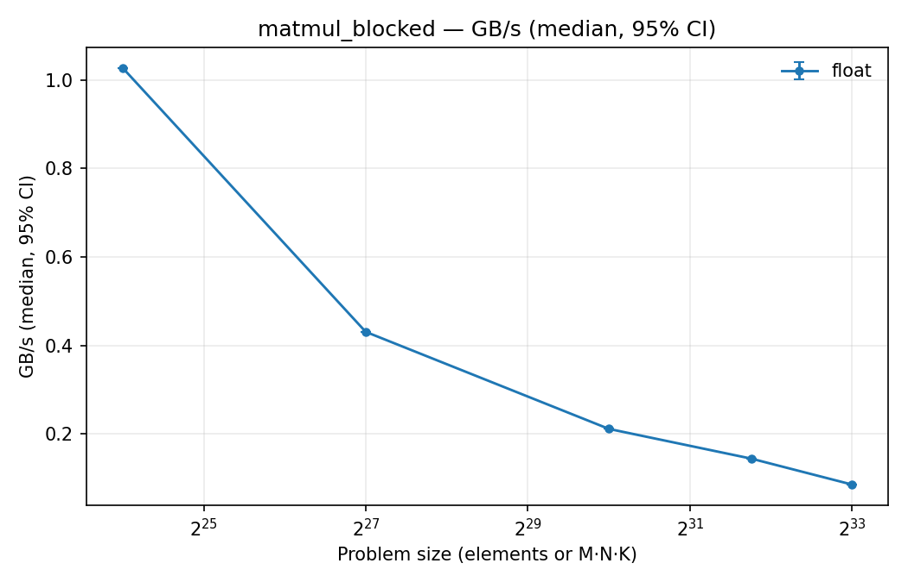
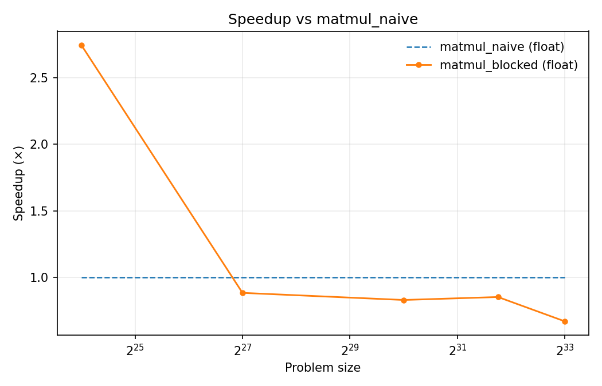
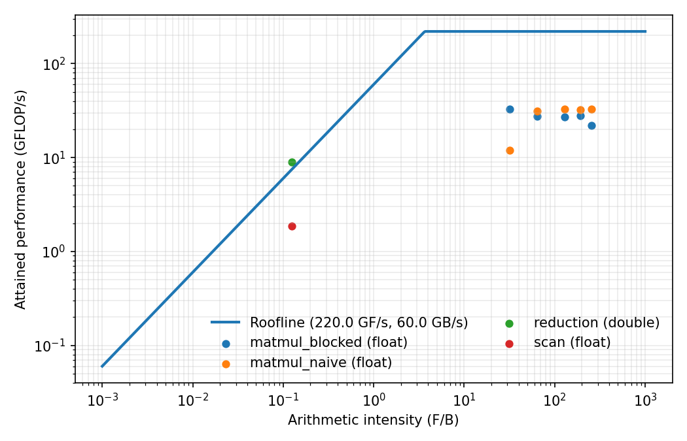

# HPC_Kernels

## Overview

**HPC_Kernels** is a compact **C++17 project** for experimenting with **classic CPU kernels** (couldn't use CUDA to utilize GPU because of hardware).
It implements three building blocks of numerical computing:

1. **Matrix multiplication (GEMM)** — naive triple-loop and a simple **cache-blocked** version.
2. **Reduction** — numerically stable **Kahan-compensated sum**.
3. **Inclusive scan** — in-place prefix sum over a vector.

The project includes:

- A **CLI benchmark driver** (`hpc_bench`) that writes CSV logs.
- A **plotting script** (`plot_bench.py`) that outputs clean, minimal **PNG figures**.
- A **unit test suite** using GoogleTest for correctness checks.

The goal: a project you can **read in one sitting, tweak in minutes, and immediately visualize results**.

---

## Requirements

- **CMake** ≥ 3.16
- **C++17 compiler** (g++, clang, or MSVC)
- **Python 3** with `pandas`, `numpy`, `matplotlib`

---

## Goals

- Provide a **readable reference** for core HPC kernels in modern C++.
- Practice **performance measurement** (GFLOP/s, GB/s, median timings roofline).
- Deliver a **lightweight benchmark CLI** that is easily extensible.
- Exercise a complete workflow: **CMake build, GoogleTest, Python plotting**.
- Encourage tuning experiments with **blocking, OpenMP, and compiler flags**.  

---

## Approach

- **C++17 headers** in `include/hpc/` implement the kernels.
- **Benchmark driver** (`src/bench.cpp`) exposes CLI options: problem sizes, reps, dtype, seed, blocked vs naive matmul.
- **CSV logging** with automatic header insertion for reproducibility.
- **Plotting script** (`scripts/plot_bench.py`) produces:
  - GFLOP/s vs size
  - GB/s vs size
  - Speedup vs baseline kernel
  - Roofline plots
- **Unit tests** (`tests/test_kernels.cpp`) verify correctness on small cases.

### Implementation Details

- **Matmul**: naive i-k-j loop; blocked variant with tunable tile size (`BS=64/128/256`).
- **Reduction**: Kahan summation for reduced round-off error.
- **Scan**: inclusive, in-place prefix sum (`x[i] = sum_{j=0..i} x[j]`).
- **Timer**: thin wrapper over `std::chrono`.
- **CSV helper**: appends rows, inserts header if missing.

---

## Key Results

- **Matmul**: Naive often performs well with compiler vectorization; blocked version shows cache reuse but may need tuning.
- **Reduction**: Demonstrates improved stability compared to naive accumulation.
- **Scan**: Achieves memory-bound throughput as expected.
- **Plots**: PNG figures highlight scaling, bandwidth vs compute, and roofline ceilings.

### Figures

<p align="center">
  
  
</p>

<p align="center">
  
  
</p>

<p align="center">
  
  <br><sub>Speedup of blocked GEMM vs naive baseline (same sizes, dtype).</sub>
</p>

<p align="center">
  
  <br><sub>Roofline with arithmetic intensity vs attained performance.</sub>
</p>


---

## How to Run

### Build

```bash
cmake -S . -B build
cmake --build build -j
```

Want all cores for matmul? Turn on OpenMP:

```bash
cmake -S . -B build -DUSE_OPENMP=ON
cmake --build build -j
```

The non-MSVC build adds `-O3 -march=native -ffast-math -funroll-loops` by default.

---

### Run Benchmarks

#### Matmul (naive vs blocked)

```bash
: > build/results_matmul_naive.csv
for n in 256 512 1024 1536 2048; do
  ./build/hpc_bench --op=matmul --M=$n --N=$n --K=$n --dtype=float     --out=build/results_matmul_naive.csv
done

: > build/results_matmul_blocked.csv
for n in 256 512 1024 1536 2048; do
  ./build/hpc_bench --op=matmul --M=$n --N=$n --K=$n --dtype=float --blocked     --out=build/results_matmul_blocked.csv
done
```

#### Reduction & Scan

```bash
./build/hpc_bench --op=reduction --size=10000000 --reps=20 --dtype=double --out=build/results_reduction.csv
./build/hpc_bench --op=scan --size=8000000 --reps=10 --dtype=float  --out=build/results_scan.csv
```

CSV header:

```
timestamp,op,M,N,K,size,dtype,reps,ns_per_rep,gflops,gbps,checksum
```

---

### Plot Results

```bash
python ./scripts/plot_bench.py   build/results_matmul_naive.csv build/results_matmul_blocked.csv   build/results_reduction.csv build/results_scan.csv   --baseline matmul_naive --roofline 220:60 --outdir plots
```

Produces:

- `plots/gflops_<op>.png`, `plots/gbps_<op>.png`
- `plots/speedup_vs_matmul_naive.png`
- `plots/roofline.png`

---

### Tests

```bash
cmake -S . -B build -DBUILD_TESTING=ON
cmake --build build -j
ctest --test-dir build --output-on-failure
```

Covers:

- Small matmul vs exact reference.  
- Reduction stability vs naive sum.  
- Inclusive scan correctness.  

---

## Conclusions

- Even minimal kernels highlight **compute-bound vs memory-bound** regimes.  
- Blocking, OpenMP, and compiler flags are effective **tuning levers**.  
- Workflow from **C++ → CSV → PNG plots** is simple yet powerful.  
- Provides a sandbox for learning **performance analysis and numerical stability**.  

---

## Troubleshooting

If plots look empty:

- Verify CSV includes both baseline (`matmul_naive`) and comparison ops at the **same sizes** and **same dtype**.  
- Use the exact baseline name with `--baseline`.  
- The plotter now renders an **in-plot message** when no data matches, instead of a blank chart.  

---

## Acknowledgements

Personal project by **Giorgos Kritopoulos**, exploring modern C++ development, benchmarking, and HPC performance analysis.  

Date: **5 September 2025**

---

## Future Work
- Add AVX2/AVX-512 intrinsics for matmul.
- Try parallel prefix-sum with OpenMP.
- Clean up plotting script (maybe add PDF export).
